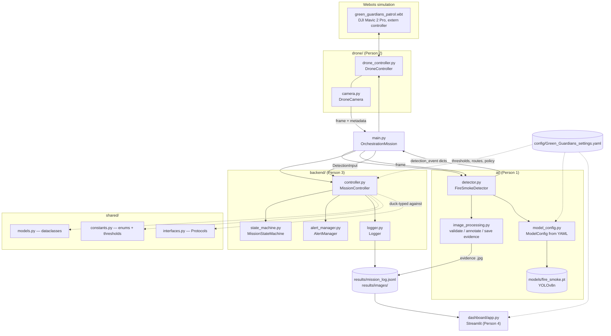
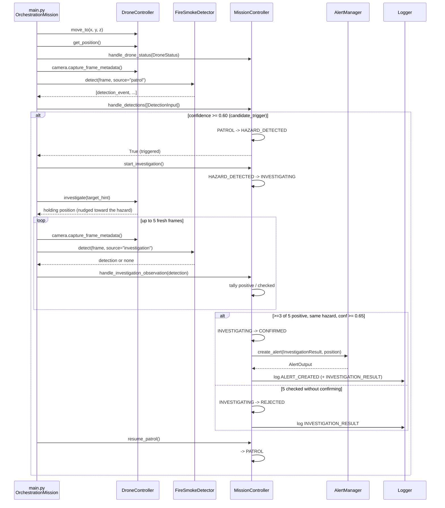

# Green Guardians — Architecture

This documents how the pieces that already exist in this repository fit
together. It describes the real, implemented code (as of the `main.py`
`OrchestrationMission` orchestration loop), not the project's original
aspirational design — see `config/Green_Guardians_settings.yaml` for the
authoritative contracts and policy values referenced throughout.

## 1. Component overview

**Key architectural fact**: `dashboard/app.py` and `main.py` are **separate
processes**. There is no HTTP API or IPC layer between them — the project is
a single Python application whose only cross-process channel is the
filesystem. The dashboard is deliberately read-only: it polls
`results/mission_log.jsonl`, `results/images/`, and
`config/Green_Guardians_settings.yaml` on a timer (`st.fragment(run_every=…)`);
it never sees `MissionController`'s live in-memory state directly. See
`dashboard/README.md` for the reasoning.

## 2. Data flow for one hazard cycle

This traces `main.py`'s `OrchestrationMission._run_waypoint()` /
`_investigate()` — the actual live loop — for one patrol leg that turns into
a confirmed (or rejected) hazard.

Every state transition, accepted/rejected input, investigation result, and
alert also gets written as one `LogEvent` JSON line to
`results/mission_log.jsonl` via `backend/logger.py` — that file is the only
record of a mission run that outlives the process, and it's what the
dashboard reads.

## 3. Module responsibilities

| Module | Owner | Responsibility |
|---|---|---|
| `drone/drone_controller.py`, `drone/camera.py` | Person 2 | Webots extern-controller flight, GPS position, camera frames |
| `ai/detector.py`, `ai/image_processing.py`, `ai/model_config.py` | Person 1 | YOLOv8n fire/smoke inference, evidence-image annotation/saving |
| `backend/controller.py`, `state_machine.py`, `alert_manager.py`, `logger.py` | Person 3 | Mission state machine, candidate/investigation/confirmation policy, alert dedup, JSONL logging |
| `main.py` | Person 3 | `OrchestrationMission` — the live loop tying drone/ai/backend together |
| `shared/models.py`, `constants.py`, `interfaces.py` | Person 3 | Dataclass contracts, enums/thresholds, structural `Protocol`s so `backend/` doesn't import `ai/`/`drone/` directly |
| `dashboard/app.py` | Person 4 | Streamlit visualization of the persisted mission log, evidence images, and config — read-only, separate process |
| `config/Green_Guardians_settings.yaml` | Person 3 (shared) | The single source of truth for thresholds, routes, and contract shapes every module is written against |

## 4. Where the contracts live

`config/Green_Guardians_settings.yaml`'s `contracts:` and
`backend_contracts:` sections describe each JSON-shaped object that crosses
a module boundary (`DetectionInput`, `DroneStatus`, `AlertOutput`,
`DashboardStatusOutput`, `LogEvent`, …). `shared/models.py` is the Python
dataclass mirror of those shapes, and `shared/constants.py` mirrors the
enums and numeric thresholds (`CANDIDATE_TRIGGER_THRESHOLD`,
`CONFIRMATION_*`, `POST_ALERT_SUPPRESSION_RADIUS_M`, …) so nothing drifts
between the YAML documentation and the running code.

## 5. Deliberate limitations (not bugs)

- **No real GPS/3-D geolocation.** `drone.investigation_maneuver`'s
  `target_hint` is a rough left/center/right bbox-based nudge, not a
  computed hazard position. See `investigation.out_of_scope` in the config.
- **Coordinates are Webots world-frame metres, not AirSim NED.** The project
  switched simulators from AirSim to Webots after the config file's
  coordinate examples were first written; `z` is altitude and is positive
  up everywhere in this codebase (`Position`, `DroneStatus`, `AlertOutput`).
- **The dashboard cannot see live in-memory state.** See §1 above — this is
  a conscious trade-off to avoid coupling two processes over an ad hoc
  channel, not a missing feature.

## 6. Running the system

- **Full live mission** (needs Webots running with
  `drone/webots_world/green_guardians_patrol.wbt` loaded, and ideally a
  trained `models/fire_smoke.pt`): `python main.py`
- **Backend only, no Webots/model needed**: replay a scripted scenario
  through the real `MissionController` — see `sample_data/README.md`.
- **Dashboard**: `streamlit run dashboard/app.py` (reads whatever's already
  in `results/`) — see `dashboard/README.md`.
- **Tests**: `pytest`
